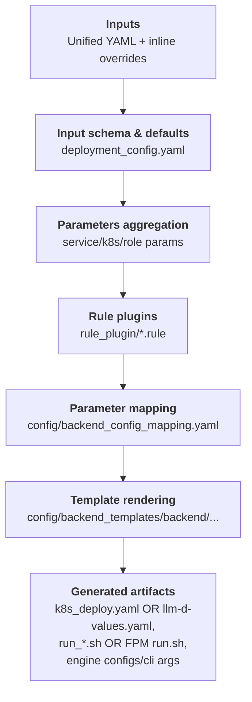

## Generator Overview

This doc explains what the generator emits, the roles of its core pieces, and how to run it to produce backend configs, bash scripts, and kubernetes yaml.

### End-to-End Flow


### Key Components
- Deployment schema (`config/deployment_config.yaml`):
  ```
  inputs:
    - key: ServiceConfig.port
    - key: ServiceConfig.served_model_name
    - key: K8sConfig.k8s_image
    - key: K8sConfig.k8s_model_cache
    - key: K8sConfig.k8s_hf_home
    - key: LlmdConfig.vllm_image
    - key: LlmdConfig.model_cache_size
    - key: WorkerConfig.prefill_workers
    - key: SlaConfig.isl
  ```
  Defines the deployment-facing inputs beyond backend flags: service ports and names, per-node GPU counts, deployment-specific settings (K8sConfig for Dynamo, LlmdConfig for llm-d), model cache configuration, and SLA knobs like ISL/OSL.

  **Model Cache Configuration:**
  - `k8s_model_cache`: Name of the PersistentVolumeClaim (PVC) to mount for caching HuggingFace models. The PVC is mounted at `/workspace/model_cache` in worker pods.
  - `k8s_hf_home`: (Optional) Path to set as the `HF_HOME` environment variable in worker pods. When `k8s_model_cache` is configured but `k8s_hf_home` is not explicitly set, it automatically defaults to `/workspace/model_cache` (the PVC mount point). This ensures HuggingFace libraries download models to the persistent volume instead of ephemeral storage.

- Backend parameter mapping (`config/backend_config_mapping.yaml`):  
  ```
  - param_key: tensor_parallel_size
    vllm: tensor-parallel-size
    sglang: tensor-parallel-size
    trtllm: tensor_parallel_size
  - param_key: cuda_graph_enable_padding
    sglang:
      key: disable-cuda-graph-padding
      value: "not cuda_graph_enable_padding"
    trtllm:
      key: cuda_graph_config.enable_padding
      value: "cuda_graph_enable_padding"
  ```
  Harmonizes three backends under unified field names and applies simple logic to handle small semantic differences between them.

- Rule plugins (`rule_plugin/*.rule`):  
  ```
  agg_prefill_decode gpus_per_worker = (tensor_parallel_size or 1) * (pipeline_parallel_size or 1) * (data_parallel_size or 1)
  prefill max_batch_size = (max_batch_size if max_batch_size else 1)
  ```
  DSL rules users can extend to influence generated configs. Field names come from `backend_config_mapping.yaml` and `deployment_config.yaml`; prefixes like `agg_`, `prefill_`, and `decode_` scope the impact to that role’s generated outputs.
  
  **Rule selection**: Use `--generator-set rule=benchmark` to switch to a different rule plugin folder under `src/aiconfigurator/generator/rule_plugin/`. If `rule` is not provided, the default production rules are used (tuned for deployment, including max batch size and CUDA graph batch size adjustments). The `benchmark` rules are designed to align generated configs with AIC simulation, using broader CUDA graph batch sizes and a stricter max batch size derived from the simulated batch size. You can add your own rule sets by creating a folder under `rule_plugin/` and selecting it via `--generator-set rule=<folder_name>`.

- Backend templates (`config/backend_templates/<backend>/`):  
  Jinja templates that turn mapped parameters into CLI args, engine configs, run scripts, and Kubernetes manifests (optionally versioned). 

### Using the Generator
You can use the generator in two ways: AIConfigurator CLI or standalone (code/CLI).
- AIConfigurator CLI end-to-end (Dynamo deployment):
  ```
  aiconfigurator cli default \
    --backend sglang \
    --backend-version 0.5.6.post2 \
    --deployment-target dynamo-j2 \
    --model-path Qwen/Qwen3-32B-FP8 \
    --system h200_sxm \
    --total-gpus 8 \
    --isl 5000 --osl 1000 --ttft 2000 --tpot 50 \
    --generator-set ServiceConfig.model_path=Qwen/Qwen3-32B-FP8 \
    --generator-set ServiceConfig.served_model_name=Qwen/Qwen3-32B-FP8 \
    --generator-set K8sConfig.k8s_engine_mode=inline \
    --generator-set K8sConfig.k8s_namespace=ets-dynamo \
    --save-dir ./results
  ```
- AIConfigurator CLI end-to-end (llm-d deployment):
  ```
  aiconfigurator cli default \
    --backend vllm \
    --deployment-target llm-d-helm \
    --model-path Qwen/Qwen3-32B \
    --system h200_sxm \
    --total-gpus 32 \
    --isl 5000 --osl 1000 --ttft 2000 --tpot 50 \
    --generator-set LlmdConfig.vllm_image=vllm/vllm-openai:v0.6.0 \
    --generator-set LlmdConfig.model_cache_size=200Gi \
    --save-dir ./results
  ```
  Notes:
  - Use `--deployment-target` to choose the orchestration platform: `dynamo-j2` (default, typed Dynamo manifests), `dynamo-python` (Python config modifiers), `llm-d-helm`/`llm-d-kustomize`, or `fpm` (a reusable resource workload plus `run.sh`).
  - For Dynamo deployments: Use `--generator-dynamo-version 0.7.1` to select the Dynamo release. This affects both the generated backend config version and the default K8s image tag. If not provided, defaults to `1.0.0`.
  - For llm-d deployments: Container image versions are specified via `LlmdConfig.vllm_image` or `LlmdConfig.sglang_image` (defaults to `latest` tags).
  - If `--generated-config-version` is provided, it overrides the generated backend version for any deployment target.
- Standalone:
  - In code:
    ```python
    from pathlib import Path
    from aiconfigurator.generator.api import (
        generate_backend_artifacts,
        generate_backend_config,
        generate_config_from_input_dict,
    )

    input_params = {
        "SlaConfig": {"isl": 32768, "osl": 1024},
        "ServiceConfig": {
            "model_path": "nvcr.io/nvidia/nemo-llm/llama-2-7b-chat-hf:1.0.0",
            "served_model_name": "llama-2-7b-chat",
            "head_node_ip": "10.0.0.100",
            "port": 8000,
            "include_frontend": True,
        },
        "K8sConfig": {
            "name_prefix": "llama7b",
            "mode": "disagg",
            "enable_router": True,
            "k8s_namespace": "dynamo",
            "k8s_image": "nvcr.io/nvidia/ai-dynamo/tensorrtllm-runtime:0.8.0",
            "k8s_engine_mode": "configmap",
            "k8s_model_cache": "pvc:model-cache-7b",
            "k8s_hf_home": "/workspace/model_cache",  # Optional: HF_HOME env var for workers (defaults to /workspace/model_cache when k8s_model_cache is set)
        },
        "Workers": {
            "prefill": {"tensor_parallel_size": 4, "max_batch_size": 8},
            "decode": {"tensor_parallel_size": 2, "max_batch_size": 16, "max_seq_len": 4096},
        },
        "WorkerConfig": {"prefill_workers": 1, "decode_workers": 2},
    }

    params = generate_config_from_input_dict(input_params, backend="trtllm")
    artifacts = generate_backend_artifacts(params, backend="trtllm", output_dir="./results/sample", backend_version="1.2.0rc5")
    ```
  - Command line: `python -m aiconfigurator.generator.main render-artifacts --backend trtllm --version 1.2.0rc5 --config sample_input.yaml --output ./results`
    ```
    # Sample sample_input.yaml
    
    ServiceConfig:
      model_path: Qwen/Qwen3-32B-FP8
      served_model_name: qwen3-32b
      head_node_ip: 0.0.0.0
      port: 8000
    K8sConfig:
      k8s_namespace: dynamo
      k8s_image: nvcr.io/nvidia/ai-dynamo/tensorrtllm-runtime:0.8.0
    WorkerConfig:
      prefill_workers: 1
      decode_workers: 1
    Workers:
      prefill:
        tensor_parallel_size: 2
        pipeline_parallel_size: 1
        data_parallel_size: 1
      decode:
        tensor_parallel_size: 2
        pipeline_parallel_size: 1
        data_parallel_size: 1
    SlaConfig:
      isl: 4000
      osl: 1000
    ```

### Generated Outputs
- [vllm & sglang] CLI argument strings per role (prefill/decode/agg) for debugging or manual runs.
- [trtllm] Engine config files (`agg_config.yaml`, `prefill_config.yaml`, `decode_config.yaml`) when the backend provides `extra_engine_args*.j2`.
- Run scripts (`run_0.sh`, `run_1.sh`, …) that assign workers to nodes and toggle frontend on the first node.
  - Note: If `model_path` is empty and you expect to automatically download the HuggingFace model, multiple processes may fetch the same model concurrently and hit the HF cache lock. In that case, download the model once at the target path before running.
- Deployment manifests:
  - **Dynamo**: Kubernetes manifest (`k8s_deploy.yaml`) with images, namespace, volumes, engine args (inline or ConfigMap), and role-specific settings.
  - **llm-d**: Helm values (`llm-d-values.yaml`) for the llm-d-modelservice chart with model artifacts, parallelism, and container configurations.
  - **FPM V1**: exactly `k8s_deploy.yaml` and `run.sh`; see [FPM V1 Target](#fpm-v1-target).
- Benchmark helpers (non-FPM targets):
  - `bench_run.sh` and `k8s_bench.yaml` are generated alongside normal deployment artifacts for running `aiperf` benchmarks. The FPM target emits neither helper.
  - `concurrency_array` is built from a base list (`1 2 8 16 32 64 128`) plus `BenchConfig.estimated_concurrency` and its +/-5% neighbors when the estimate is available.

### FPM V1 Target

`--deployment-target fpm` supports a vLLM single aggregated-worker topology with exactly one worker replica. It emits a keepalive Pod when the resolved topology fits on one node and a `LeaderWorkerSet` when it spans multiple nodes. Router/planner configurations and invalid FPM topologies fail closed. Other deployment targets keep their existing behavior.

`Workers.agg.gpus_per_worker` is the total GPU count for the worker replica; a value larger than `NodeConfig.num_gpus_per_node` produces a multinode worker and therefore an LWS. The resolved `TP * PP * DP` must equal that total, which must divide evenly across the resolved node count. Multinode DP must also divide evenly across nodes and uses the `mp` data-parallel backend. A cluster that runs a multinode artifact must have the LeaderWorkerSet API and controller installed.

The FPM overlay accepts `Workers.agg.extra_cli_args` as a `list[str]` and concrete `K8sConfig.extra_env` entries in `{name, value}` form. Rules, mappings, and versioned templates still produce the base vLLM command; `extra_cli_args` are appended to that resolved command. `--benchmark-mode` is required and accepts `agg`, `prefill`, or `decode`; it selects the runtime collection phase without changing the required single aggregated-worker topology. `valueFrom`, `envFrom`, and Secret-derived environment values are not supported in V1. The generator owns multinode coordination arguments such as `--nnodes`, `--node-rank`, `--headless`, and the local data-parallel rank arguments, so callers must not pass those through the overlay.

The target emits only:

```text
artifacts/
├── k8s_deploy.yaml   # keepalive Pod or LeaderWorkerSet; resources and mounts only
└── run.sh            # rank-aware exports plus the complete resolved vLLM command
```

The resource workload contains no engine arguments or engine/FPM environment variables. It preserves the generated image, per-node GPU limit, custom resources, volumes, and mounts. `K8sConfig.fpm_shared_memory_size` sets the generated `/dev/shm` `emptyDir` limit, `K8sConfig.fpm_resource_labels` adds workload and Pod labels, and `K8sConfig.worker_extra_pod_spec.mainContainer.resources` supplies requests or limits such as memory and ephemeral storage. The resolved per-node GPU count cannot be overridden by this resource overlay. By default `/results` is a Pod-local `emptyDir`; matching user-provided `results` or `dshm` volume-and-mount pairs are preserved.

On multiple nodes, `run.sh` requires the LWS controller-injected `LWS_WORKER_INDEX` and `LWS_LEADER_ADDRESS` values and adds the required model-parallel or data-parallel coordination arguments. A custom `--dump-config-to` path must contain `{node_rank}` for a multinode topology; the script replaces it with the current node rank. Without that option, the generator uses `/results/resolved-config-node{node_rank}.json` on multiple nodes and `/results/resolved-config-node0.json` on one node. This placeholder substitution applies only to `--dump-config-to`, not to environment values or other CLI arguments.

For data parallelism, DP rank 0 writes the configured base output (for example, `benchmark.json`) and later DP ranks write suffixed files such as `benchmark_dp1.json`. Each node waits for its local DP rank range. Before stopping its engine, the script verifies the current schema-v1 completion contract: `status: complete`, `valid: true`, complete zero-skipped coverage, matching benchmark mode and point phase, and nested FPM samples for the expected DP rank. It also accepts the earlier Phase 1 schema-v2 `status: passed` plus `config.dp_rank` form. This is a completion and identity gate, not full FPM result validation.

The FPM collector or agent remains responsible for staging the complete runtime bundle—scheduler code, cases, capacity, run-spec, runtime contracts, and validators—on every Pod; starting `run.sh` concurrently on all Pods in an LWS; coordinating exit status; strictly validating, downloading, aggregating, and recording evidence for the results; and cleaning up the workload. For a single-node Pod, the basic execution flow is:

```bash
kubectl apply -f artifacts/k8s_deploy.yaml
kubectl wait --for=condition=Ready pod/<pod> --timeout=10m
kubectl exec -i <pod> -- bash -s < artifacts/run.sh
```

Each collection run starts a new engine, so the model is still loaded on every run. The script stops a result-producing engine after its expected files pass the completion gate; the collector coordinates headless followers and final cleanup. The script refuses to overwrite any expected benchmark output path, so use distinct paths for each run. Reusing the resource workload avoids re-requesting resources, but V1 does not provide a persistent engine or in-GPU model reuse.

The current vLLM template matrix tops out at `0.20.1`. Flags required only by the reference `0.24.0` runtime can be passed through as tokens, but their runtime compatibility is not yet validated by the generator.

### TRT-LLM Deployment Notes
When deploying with TRT-LLM, the generated run scripts (`run_x.sh`) reference engine config files at `/workspace/engine_configs/`. Before executing the run scripts, you must:

1. Create the engine configs directory:
   ```bash
   mkdir -p /workspace/engine_configs
   ```

2. Copy the generated engine config files to this location:
   ```bash
   # For aggregated mode:
   cp agg_config.yaml /workspace/engine_configs/
   
   # For disaggregated mode:
   cp prefill_config.yaml decode_config.yaml /workspace/engine_configs/
   ```

3. Execute the run script:
   ```bash
   bash run_0.sh
   ```

Refer to the [Dynamo Deployment Guide](dynamo_deployment_guide.md) for detailed deployment instructions. 

### Generator Validator
The generator validator checks that generated engine configs or CLI args are accepted by the backend runtime version. It parses the generated output using each backend's argument schema and reports unknown or invalid flags early.

**Usage (run inside the matching runtime image):**
- TRT-LLM runtime image (e.g. `tensorrtllm-runtime`):
  ```
  python tools/generator_validator/validator.py \
    --backend trtllm \
    --path /path/to/results
  ```
- vLLM runtime image:
  ```
  python tools/generator_validator/validator.py \
    --backend vllm \
    --path /path/to/results
  ```
- SGLang runtime image:
  ```
  python tools/generator_validator/validator.py \
    --backend sglang \
    --path /path/to/results
  ```

**`--path` meaning (file or directory):**

Note: The validator currently supports Dynamo deployments only (`--deployment-target dynamo-j2` or `dynamo-python`). Support for llm-d Helm values validation is not yet implemented.

- File: point directly to a single engine config YAML (TRT-LLM) or `k8s_deploy.yaml` (vLLM/SGLang).
- Directory: point to a generator results root with the expected layout:
  - TRT-LLM: `agg/top1/agg_config.yaml` and `disagg/top1/{decode,prefill}_config.yaml`
  - vLLM / SGLang (Dynamo): `agg/top1/k8s_deploy.yaml` and `disagg/top1/k8s_deploy.yaml`
  - vLLM / SGLang (llm-d): `agg/top1/llm-d-values.yaml` and `disagg/top1/llm-d-values.yaml` (validator not yet supported)

**How it works (high level):**
- TRT-LLM: loads `tensorrt_llm.llmapi.llm_args.TorchLlmArgs` and validates keys against the runtime schema.
- vLLM: loads `vllm.engine.arg_utils.EngineArgs` and parses CLI args to build an engine config.
- SGLang: loads `sglang.srt.server_args.ServerArgs` and parses CLI args found in the generated Kubernetes manifest.
